# Docker Dev Stack — 2048 Game

## Problem Statement
Running a web application directly on a server creates two problems: 
security risks from uncontrolled dependencies and difficulty maintaining 
a consistent environment across machines. This project solves both by 
containerizing the application to isolate its environment, and configuring 
automatic restarts to ensure the app stays available even after crashes 
or server reboots.

## Architecture



## Tech Stack
- Docker 29.3.0
- Docker Compose v5.1.0
- Nginx Alpine
- AWS EC2 (t2.micro)

## Setup

### Prerequisites
- AWS EC2 running Ubuntu 22.04
- Docker and Docker Compose installed
- Port 80 open in Security Group

### Run
```bash
git clone https://github.com/vaibhavshejwal/docker-dev-stack.git
cd docker-dev-stack
docker compose up -d --build
```

### Verify security headers
```bash
curl -I http://localhost
```

## Custom Features
- Custom Nginx configuration replacing default server block
- Production security headers (X-Frame-Options, X-XSS-Protection, 
  X-Content-Type-Options)
- Container restart policy ensuring availability after crashes/reboots

## What I Learned
- How to write a Dockerfile from scratch and understand each instruction
- Difference between a Docker image and a running container
- How Docker port binding connects external traffic to containers
- Why Nginx configuration controls where files are served from
- How to verify deployments using curl instead of just browser checks
- Professional Git workflow — laptop → GitHub → EC2